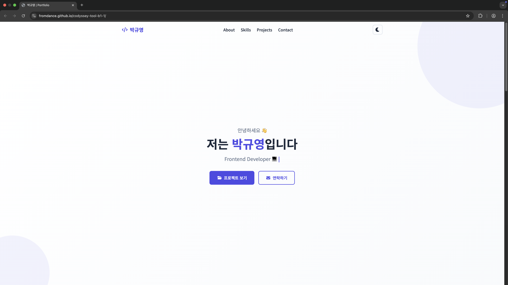
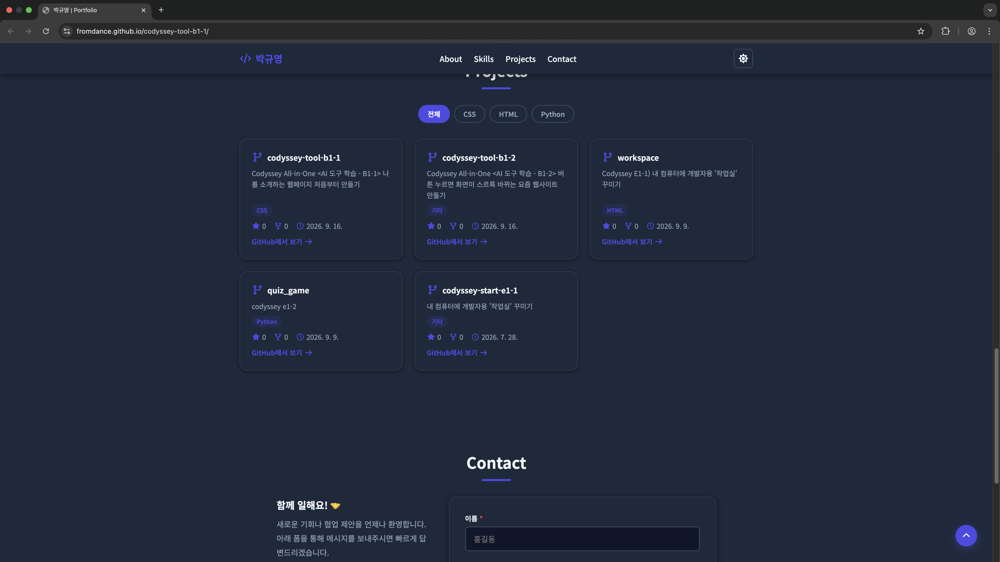
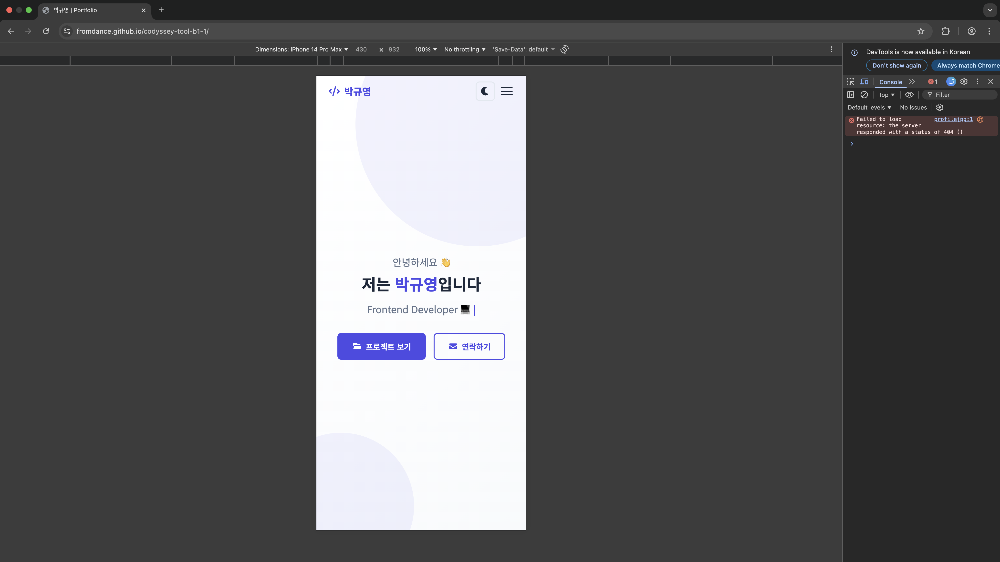
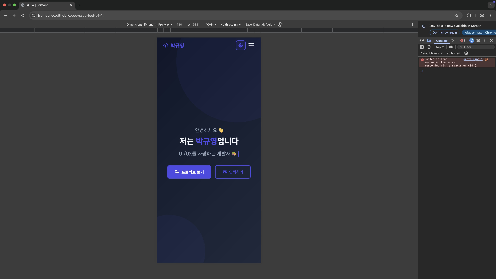

# codyssey-tool-b1-1
AI 도구 학습 - B1-1: 나를 소개하는 웹페이지 처음부터 만들기
## 프로젝트 설명
- 라이브러리 없이, 순수 HTML/CSS/Javascript를 사용해 반응형 포트폴리오 웹사이트를 완성하는 과제
- 또한, Github API, Formspree API 등 외부 서비스와 연동하여 외부 API 호출시 발생하는 로딩/에러/성공 상태를 처리하는 경험을 기름
## 수행 항목 체크 리스트
- [x] 시맨틱 마크업을 사용한 HTML 구조
- CSS 스타일링
  - [x] 레이아웃 - 네비게이션(`Flexbox`), 프로젝트 카드(`Grid`)
  - [x] 반응형 디자인
  - [x] 시각효과
- Javascript
  - [x] `onclick`, `onerror` 등 속성 사용하지 않고 `addEventListener`로 이벤트 연결
  - [x] DOM 요소 조작
    - `querySelector`, `querySelectorAll`로 요소를 선택
    - `textContent`, `innerHTML`로 내용을 변경
    - `classList.add`, `remove`, `toggle`로 클래스를 조작
  - [x] 이벤트 처리
    - `click`, `submit`, `scroll`, `input` 이벤트를 다룸
    - `event.preventDefault()`로 기본 동작을 방지
- 인터랙션 구현
  - [x] 햄버거 메뉴 토글
  - [x] 부드러운 스크롤
  - [x] 스크롤 탑 버튼 (스크롤 300px 이상에서 버튼 등장(`SCROLL_TOP_BUTTON_VISIBLE_Y`))
  - [x] 네비게이션 스타일 변경 (스크롤 60px 이상에서 변경(`NAV_BACKGROUND_COLOR_CHANGE_Y`))
  - [x] 다크 모드
  - [x] 스크롤 애니메이션 (`IntersectionObserver` 임계값은 0.2로 설정(`{ threshold: 0.2 }`))
- [x] 컨택트 폼 UX
- [x] ES6+ 문법 & 배열 메서드
- [x] 비동기 처리 & API 연동
- [x] 상태 관리 패턴
    1. 다크 모드 토글 -> 테마 상태 변경(`state.theme`) -> 전체 화면 스타일 변경(`document`의 `data-theme` 속성값을 `state.theme`로 변경)
    2. 햄버거 메뉴 토글 -> 네비게이션 메뉴 상태 변경(`state.isMenuOpen`) -> 네비게이션 메뉴 표시/숨김
    3. CONTACT 폼 입력 -> 폼 상태 변경(`'blur'`, `'input'`) 및 유효성 검사(`validateField`) -> 에러 메세지 표시/숨김(`errorEl.textContent = message;`)
    4. CONTACT 폼 제출 -> 전송 성공 여부(`res.ok` 또는 에러 발생해 catch) 상태 변경 -> 성공 메시지/실패 메시지 표시(`formSuccess`/`formErrorGlobal`)
    5. Github API 호출 -> 로딩/성공/에러 상태 변경(`res.ok`) → Projects 섹션 렌더링 변경(`projectsGrid.innerHTML`)
    6. 필터 버튼 클릭 -> 필터 상태 변경(`state.activeFilter`) -> 프로젝트 목록 변경(`state.allProjects.filter(...)`)
- [x] 배포
- [x] (보너스) 프로젝트 필터링
- [x] (보너스) 타이핑 효과
- [x] (보너스) 폼 실제 전송
- [x] (보너스) 시스템 다크 모드 감지
## 사용 기술
- Javascript
- HTML5
- CSS3
- [Font Awesome 7.2.0](https://fontawesome.com/)
- [Google Fonts](https://fonts.google.com/)
- [Github Pages](https://docs.github.com/ko/pages)
## 배포
- Github Pages를 사용하여, 아래 링크로 배포하였음
- https://fromdance.github.io/codyssey-tool-b1-1/
## 스크린샷
### 데스크탑
#### 라이트 모드

#### 다크 모드

### 모바일
#### 라이트 모드

#### 다크 모드

## 과제 목표
- HTML에서 `시맨틱 태그`를 왜 사용하는지 또한 본인이 어떤 기준으로 구조를 설계했는지 설명할 수 있다.
  - `시맨틱 태그`를 사용하는 이유: 태그 안의 내용이 어떤 것인지 태그 자체로 설명하는 의미론적 가치를 부여하므로써, `코드의 가독성`을 높이고, 검색 엔진이 검색 순위를 유의미하게 산정할 수 있도록 돕고, 스크린 리더를 사용하는 사용자가 페이지를 탐색하는 것을 도울 수 있기 때문 [#](https://developer.mozilla.org/en-US/docs/Glossary/Semantics)
- CSS에서 `Flexbox`와 `Grid`의 차이, 그리고 언제 각각을 선택해야 하는지 설명할 수 있다.
  - `Flexbox`: 항목을 행(또는 열)으로 배치하는 콘텐츠 중심의 1차원 레이아웃 방식. [#](https://developer.mozilla.org/en-US/docs/Learn_web_development/Core/CSS_layout/Flexbox)
    - `콘텐츠 중심`이므로, 컨테이너 내에서 콘텐츠가 차지하는 공간은 `콘텐츠의 크기`가 정함 (새로운 줄로 줄바꿈되는 경우엔 아이템 크기 + 해당 줄의 가용한 공간에 따라 조정)
    - 부모 요소 내의 콘텐츠 블록을 수직으로 중앙에 정렬할 때
    - 사용 가능한 너비/높이에 관계없이, 컨테이너 내 모든 자식요소가 가용한 너비/높이를 균등하게 차지하도록 할 때
    - 다중 열(column) 레이아웃에서, 각 열에 포함된 콘텐츠 양에 관계없이 모든 열의 높이를 동일하게 표시하려 할 때
  - `Grid`: 항목을 행과 열 모두를 고려해 배치하는 레이아웃 중심의 2차원 레이아웃 방식. [#](https://developer.mozilla.org/en-US/docs/Learn_web_development/Core/CSS_layout/Grids)
    - `레이아웃 중심`이므로, 레이아웃을 먼저 작성한 뒤 그 위에 아이템을 배치함
    - [fr](https://developer.mozilla.org/en-US/docs/Web/CSS/Reference/Values/flex_value)이라는, '남은 그리드 컨테이너 공간 중 차지하는 비율'을 나타내는 특별한 단위를 제공하므로, 이러한 단위를 사용해 비율을 맞춰야 할 때
    - 행과 열, 둘 다 제어하여 요소들을 배치하려고 할 때([grid-template-columns](https://developer.mozilla.org/ko/docs/Web/CSS/Reference/Properties/grid-template-columns)와 [grid-template-rows](https://developer.mozilla.org/en-US/docs/Web/CSS/Reference/Properties/grid-template-rows)를 활용)
    - 다룰 요소 중 일부 또는 전체가 동일한 패턴을 반복하여 표시해야할 경우, 이를 좀 더 편하게 표현하려 할 때([repeat()](https://developer.mozilla.org/en-US/docs/Web/CSS/Guides/Grid_layout/Basic_concepts#track_listings_with_repeat_notation))
    - [repeat(auto-fit)](https://developer.mozilla.org/en-US/docs/Web/CSS/Reference/Values/repeat#auto-fit), [minmax](https://developer.mozilla.org/en-US/docs/Web/CSS/Reference/Values/minmax)과 같은 요소를 활용해 반복되는 패턴을 반응형으로 표현하려 할 때
- `querySelector`로 DOM을 선택하고, `addEventListener`로 이벤트를 연결하는 흐름을 설명할 수 있다.
  - `querySelector()`/`querySelectorAll()`: 인자로 전달받은 `CSS 선택자(그룹)`에 일치하는 문서 내 `첫 번째 요소(또는 요소들)`을 반환하는 함수.
  - `addEventListener`: 요소를 나타내는 [Element](https://developer.mozilla.org/en-US/docs/Web/API/Element)의 메서드(정확히는 [EventTarget](https://developer.mozilla.org/en-US/docs/Web/API/EventTarget) 인터페이스의 메서드)로, 지정된 이벤트가 대상에 전달될 때마다 호출될 함수를 설정하는 메서드
    - `addEventListener`를 쓰는 이유
      - 하나의 이벤트에 대해 여러 개의 핸들러를 추가할 수 있음
        - `addEventListener`가 `EventTarget`의 이벤트 유형별 이벤트 리스너 목록에 `함수` 또는 `handleEvent() 함수를 구현하는 객체`를 추가하는 방식으로 동작하기 때문
          - 이때, 동일한 함수 또는 객체를 추가하려 하는 경우 추가되지 않음(단, 익명 함수의 경우 동일한 함수로 인식하지 않음)
      - `onXYZ`(ex. `onerror`) 속성을 사용하는 것과 달리, 리스너가 활성화되는 단계(캡처링, 버블링)를 세밀하게 제어할 수 있음
        - `option` 중 `capture` 옵션을 `true`로 줄 경우, DOM 트리 상에서 아래에 있는 `이벤트 타겟`에게 전달되기 전에 이 리스너에게 먼저 전달됨(캡처링) [#](https://ko.javascript.info/bubbling-and-capturing#ref-311)
        - 만약 해당 옵션을 주지 않았다면, 리스너는 `버블링 단계`에서 동작(리스너가 설정된 요소 및 그 하위 요소에서 이벤트 발생해, 위로 전파될 때 감지)
      - `HTML`, `SVG` 요소 뿐만 아니라, 모든 Event Target에 동작함([Document](https://developer.mozilla.org/en-US/docs/Web/API/Document), [Window](https://developer.mozilla.org/en-US/docs/Web/API/Window) 등)
- 화살표 함수, 구조분해 할당, 배열 메서드(map/filter)가 왜 필요하고 어떻게 사용하는지 설명할 수 있다.
- `fetch`와 `async/await`로 비동기 데이터를 가져오고, 로딩/성공/실패 상태를 UI로 어떻게 표현했는지 설명할 수 있다.
- "하나의 기능"을 만들기 위해 이벤트 → 상태 변경 → DOM 업데이트가 어떻게 연결되는지 설명할 수 있다. (React의 상태-렌더링 흐름의 기초)